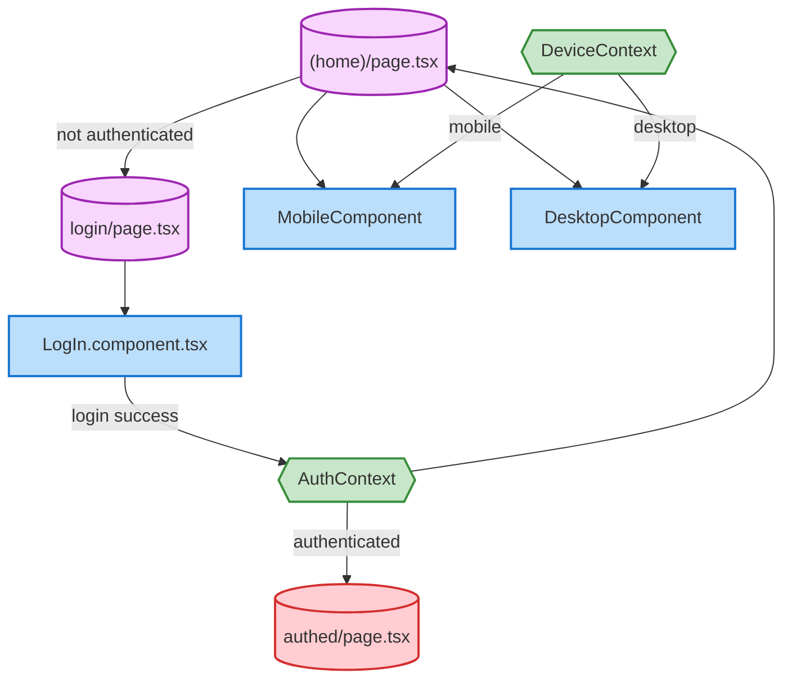

# App Structure

## Main Structure:
- app/(home)/page.tsx is your main entry point
    - It likely handles responsive rendering between Mobile and Desktop components
- Responsive Components:
    - MobileComponent.tsx - Renders on mobile devices
    - DesktopComponent.tsx - Renders on desktop devices
- Authentication Flow:
    - login/page.tsx - Login page container
    - LogIn.component.tsx - Contains login form and authentication logic
    - authed/page.tsx - Protected page for authenticated users

